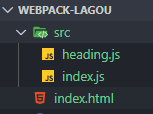
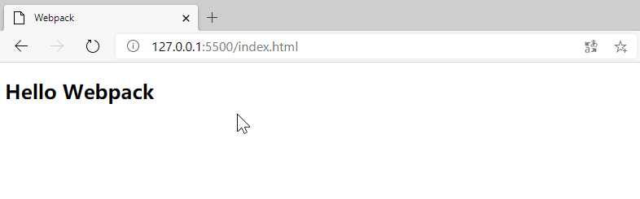
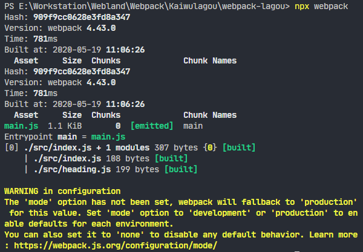

# 如何使用 Webpack 实现模块化打包？

## javascript module

*index.html*

```html
<script src="src/index.js" type="module"></script>
```

> `type="module"` 用法是 ES Modules 中提出的标准，用来区分加载一个普通 JS 脚本还是一个模块。

有了 JS module，可以使用 `export` 关键字去导出任何东西，可以使用 `import` 从任何其他模块导入模块。

 

*src\heading.js*

```js
export default () => {
  const element = document.createElement('h2');
  element.textContent = 'Hello Webpack';
  element.addEventListener('click', () => alert('Hello Webpack'));
  return element;
}
```

*src\index.js*

```js
import createHeading from './heading.js'

const heading = createHeading();
document.body.append(heading);`
```

*index.html*

```html
<!DOCTYPE html>
<html lang="en">
<head>
  <meta charset="UTF-8">
  <meta name="viewport" content="width=device-width, initial-scale=1.0">
  <title>Webpack</title>
</head>

<body>
  <script src="src/index.js" type="module"></script>
</body>

</html>
```

 

## 使用 webpack 打包

Webpack 是一个 npm 工具模块，所以我们先初始化一个 package.json 文件，用来管理 npm 依赖版本，完成之后，再来安装 Webpack 的核心模块以及它的 CLI 模块，具体操作如下：

```sh
$ npm init --yes
$ npm i webpack webpack-cli --save-dev
```

- webpack 是 Webpack 的核心模块
- webpack-cli 是 Webpack 的 CLI 程序，用来在命令行中调用 Webpack

安装完成之后，webpack-cli 所提供的 CLI 程序就会出现在 node_modules/.bin 目录当中，我们可以通过 npx 快速找到 CLI 并运行它，具体操作如下：

```sh
$ npx webpack --version
4.43.0
```

> npx 是 npm 5.2 以后新增的一个命令，可以用来更方便的执行远程模块或者项目 node_modules 中的 CLI 程序。

有了 Webpack 后，就可以直接运行 webpack 命令来打包 JS 模块代码，具体操作如下：

```sh
$ npx webpack
```

命令在执行的过程中，Webpack 会自动从 src/index.js 文件开始打包，然后根据代码中的模块导入操作，自动将所有用到的模块代码打包到一起。

完成之后，控制台会提示：顺着 index.js 有两个 JS 文件被打包到了一起。与之对应的就是项目的根目录下多出了一个 *dist* 目录，我们的打包结果就存放在这个目录下的 *main.js* 文件中，具体操作如下图所示：

 

重新修改 *index.html* 文件引入路径，打包后代码不再有 `import` 和 `export`，可以删除 `type="module"`。刷新浏览器，页面正常工作：

```html
<!DOCTYPE html>
<html lang="en">
<head>
  <meta charset="UTF-8">
  <meta name="viewport" content="width=device-width, initial-scale=1.0">
  <title>Webpack</title>
</head>

<body>
  <script src="dist/main.js"></script>
</body>

</html>
```

将 Webpack 指令定义到 npm scripts 中，使用起来更加方便：

```json
{
  "name": "getting-started",
  "version": "0.1.0",
  "description": "Webpack getting started",
  "main": "index.js",
  "scripts": {
    "build": "webpack"
  },
  "author": "soonespresso",
  "license": "MIT",
  "devDependencies": {
    "webpack": "^4.43.0",
    "webpack-cli": "^3.3.11"
  }
}

```

Webpack 使用的总结：先安装 webpack 相关的 npm 包，然后使用 webpack-cli 所提供的命令行工具进行打包。

## 配置 Webpack 打包过程

Webpack 4 之后的版本支持零配置方式直接启动打包，整个过程约定：将 *src\index.js* 作为打包入口，最终打包结构存放到 *dist\main.js* 中。

但更多时候我们需要自定义这些路径约定，例如：我们需要它的打包入口是 *src/main.js*，那此时我们通过配置文件的方式修改 Webpack 的默认配置，在项目的根目录下添加一个 *webpack.config.js*，具体结构如下：

```
> webpack-lagou
  ├ src
  │  ├ heading.js
  │  └ main.js
  ├ index.html
  ├ package.json
+ └ webpack.config.js .................... Webpack 配置文件
```

- webpack.config.js：是一个运行在 Node.js 环境中的 JS 文件，也就是说我们需要按照 CommonJS 的方式编写代码，这个文件可以导出一个对象，我们可以通过所导出对象的属性完成相应的配置选项。

### entry 

添加一个 entry 属性，指定 Webpack 打包的入口文件路径。

*webpack.config.js*

```js
module.exports = {
  entry: './src/main.js'
}
```

### output 

官方文档：https://webpack.js.org/configuration/#options

通过 output 属性设置输出文件的位置。

- output 属性的值必须是一个对象，通过这个对象的 filename 指定输出文件的文件名称，path 指定输出的目录。

```js
const path = require('path');

module.exports = {
  entry: './src/main.js',
  output: {
    filename: 'bundle.js',
    path: path.join(__dirname, 'output')
  }
}
```

> *webpack.config.js* 是运行在 Node.js 环境中的代码，所以直接可以使用 path 之类的 Node.js 内置模块。

## 让配置文件支持智能提示

 VSCode 对于代码的自动提示是根据成员的类型推断出来的，换句话说，如果 VSCode 知道当前变量的类型，就可以给出正确的智能提示。即便你没有使用 TypeScript 这种类型友好的语言，也可以通过类型注释的方式去标注变量的类型。

默认 VSCode 并不知道 Webpack 配置对象的类型，我们通过 import 的方式导入 Webpack 模块中的 Configuration 类型，然后根据类型注释的方式将变量标注为这个类型，这样我们在编写这个对象的内部结构时就可以有正确的智能提示了，具体代码如下所示：

*webpack.config.js*

```js
import { Configuration } from 'webpack'

/**
 * @type {Configuration}
 */
const config = {
  mode: 'none',
  entry: './src/index.js',
  output: {
    filename: 'bundle.js'
  },
}

module.exports = config;
```

> 打包时需要注释掉：`import { Configuration } from 'webpack'`，否则会报错。

## Webpack 工作模式

官方文档：https://webpack.js.org/configuration/mode/

Webpack 4 新增了一个工作模式的用法，这种用法大大简化了 Webpack 配置的复杂程度。你可以把它理解为针对不同环境的几组预设配置：

- **production** 模式下，启动内置优化插件，自动优化打包结果，打包速度偏慢；
- **development** 模式下，自动优化打包速度，添加一些调试过程中的辅助插件；
- **none** 模式下，运行最原始的打包，不做任何额外处理。

> 如果你没有配置工作模式，打包过程中命令行终端会打印一个对应的配置警告。
> 在这种情况下 Webpack 将**默认使用 production 模式**去工作。
>
> production 模式下 Webpack 内部会自动启动一些优化插件，
> 例如，自动压缩打包后的代码。这对实际生产环境是非常友好的，但是打包的结果就无法阅读了。

修改 Webpack 工作模式的方式有两种：

- 通过 CLI --mode 参数传入；
- 通过配置文件设置 mode 属性。

## 打包结果运行原理

先将 Webpack 工作模式设置为 none，按照最原始的状态进行打包。

按照 none 模式打包完成后，我们打开最终生成的 bundle.js 文件，如下图所示：

*dist\bundle.js*

```js
(function(modules) { // webpackBootstrap

	// 缓存加载过的模块
	// The module cache
	var installedModules = {};

	// 加载指定模块
	// The require function
	function __webpack_require__(moduleId) {

	  // Check if module is in cache
	  if (installedModules[moduleId]) {
		return installedModules[moduleId].exports;
	  }

	  // Create a new module (and put it into the cache)
	  var module = installedModules[moduleId] = {
      i: moduleId,
      l: false,
      exports: {}
	  };

	  // Execute the module function
	  modules[moduleId].call(module.exports, module, module.exports, __webpack_require__);

	  // Flag the module as loaded
	  module.l = true;

	  // Return the exports of the module
	  return module.exports;
	}

	// expose the modules object (__webpack_modules__)
	__webpack_require__.m = modules;

	// expose the module cache
	__webpack_require__.c = installedModules;

	// define getter function for harmony exports
	__webpack_require__.d = function(exports, name, getter) {

	  if (!__webpack_require__.o(exports, name)) {

		Object.defineProperty(exports, name, {
		  enumerable: true,
		  get: getter
		});
	  }
	};

	// define __esModule on exports
	__webpack_require__.r = function(exports) {

	  if (typeof Symbol !== 'undefined' && Symbol.toStringTag) {

		Object.defineProperty(exports, Symbol.toStringTag, {
		  value: 'Module'
		});
	  }

	  Object.defineProperty(exports, '__esModule', {
		value: true
	  });
	};

	// create a fake namespace object
	// mode & 1: value is a module id, require it
	// mode & 2: merge all properties of value into the ns
	// mode & 4: return value when already ns object
	// mode & 8|1: behave like require
	__webpack_require__.t = function(value, mode) {

	  if (mode & 1) value = __webpack_require__(value);

	  if (mode & 8) return value;

	  if ((mode & 4) && typeof value === 'object' && value && value.__esModule) return value;

	  var ns = Object.create(null);

	  __webpack_require__.r(ns);

	  Object.defineProperty(ns, 'default', {
		enumerable: true,
		value: value
	  });

	  if (mode & 2 && typeof value != 'string') for (var key in value) __webpack_require__.d(ns, key,
	  function(key) {
		return value[key];
	  }.bind(null, key));

	  return ns;
	};

	// getDefaultExport function for compatibility with non-harmony modules
	__webpack_require__.n = function(module) {

	  var getter = module && module.__esModule ?

	  function getDefault() {
		return module['default'];
	  }:

	  function getModuleExports() {
		return module;
	  };

	  __webpack_require__.d(getter, 'a', getter);

	  return getter;
	};

	// Object.prototype.hasOwnProperty.call
	__webpack_require__.o = function(object, property) {
	  return Object.prototype.hasOwnProperty.call(object, property);
	};

	// __webpack_public_path__
	__webpack_require__.p = "";

	// 开始加载源代码中的入口模块
	// Load entry module and return exports
	return __webpack_require__(__webpack_require__.s = 0);
  })
  ([
  /* 0 */
  (function(module, __webpack_exports__, __webpack_require__) {
  
	"use strict";
	__webpack_require__.r(__webpack_exports__);
	/* harmony import */
	var _heading_js__WEBPACK_IMPORTED_MODULE_0__ = __webpack_require__(1);
  
	const heading = Object(_heading_js__WEBPACK_IMPORTED_MODULE_0__["default"])();
	document.body.append(heading);
  }),

  /* 1 */
  (function(module, __webpack_exports__, __webpack_require__) {
  
	"use strict";
	__webpack_require__.r(__webpack_exports__);
	/* harmony default export */
	__webpack_exports__["default"] = (() =>{
	  const element = document.createElement('h2');
	  element.textContent = 'Hello Webpack';
	  element.addEventListener('click', () =>alert('Hello Webpack'));
	  return element;
	});
  })
]);
```

整体生成的代码其实就是一个立即执行函数，这个函数是 Webpack 工作入口（webpackBootstrap），它接收一个 modules 参数，调用时传入了一个数组。

```js
(function(modules) { // webpackBootstrap
  ...
})
([
  /* 0 */
  (function(module, __webpack_exports__, __webpack_require__) {...}),
  /* 1 */
  (function(module, __webpack_exports__, __webpack_require__) {...})
]);
```

这个数组，里面的元素均是参数列表相同的函数。这里的函数对应的就是我们源代码中的模块，也就是说每个模块最终被包裹到了这样一个函数中，从而实现模块私有作用域，

```js
[
  /* 0 */
  (function(module, __webpack_exports__, __webpack_require__) {
  
    "use strict";
    __webpack_require__.r(__webpack_exports__);
    /* harmony import */
    var _heading_js__WEBPACK_IMPORTED_MODULE_0__ = __webpack_require__(1);

    // src\index.js
    const heading = Object(_heading_js__WEBPACK_IMPORTED_MODULE_0__["default"])();
    document.body.append(heading);
  }),

  /* 1 */
  (function(module, __webpack_exports__, __webpack_require__) {
  
    "use strict";
    __webpack_require__.r(__webpack_exports__);
    /* harmony default export */
    __webpack_exports__["default"] = (() =>{
      
      // src\heading.js
      const element = document.createElement('h2');
      element.textContent = 'Hello Webpack';
      element.addEventListener('click', () =>alert('Hello Webpack'));
      return element;
    });
  })
]
```


# 参考资料

Javascript module

- [在浏览器中使用javascript module（译）](https://www.jianshu.com/p/f7db50cf956f)
- [阮一峰的ES6---Module的加载实现](https://www.imooc.com/article/20630?block_id=tuijian_wz)

Symbol.toStringTag

- [MDN web docs | Symbol.toStringTag](https://developer.mozilla.org/zh-CN/docs/Web/JavaScript/Reference/Global_Objects/Symbol/toStringTag)
- [Symbol.toStringTag 属性](https://www.softwhy.com/article-7583-1.html)

.gitignore

- [Git中.gitignore的配置语法](https://www.jianshu.com/p/ea6341224e89)

