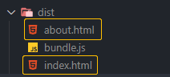
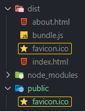
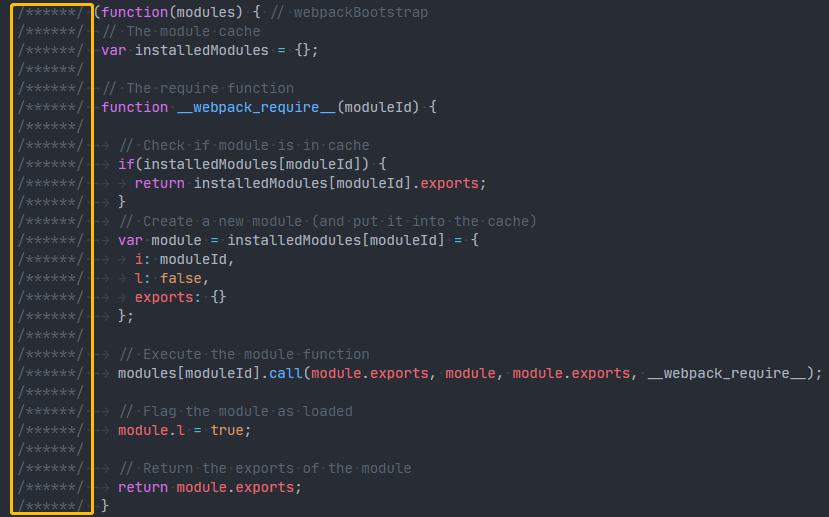
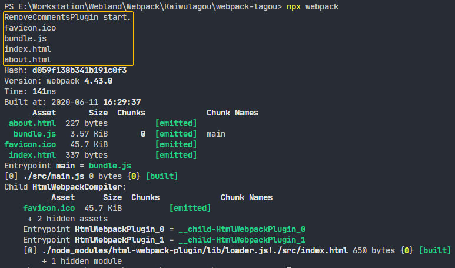
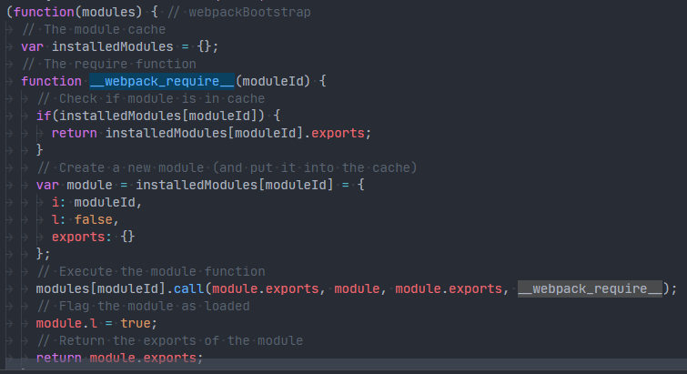

# 利用插件机制横向扩展 Webpack 的构建能力

> Webpack 插件机制的目的是为了增强 Webpack 在项目自动化构建方面的能力。

Loader 就是负责完成项目中各种各样资源模块的加载，从而实现整体项目的模块化，而 Plugin 则是用来解决项目中除了资源模块打包以外的其他自动化工作，所以说 Plugin 的能力范围更广，用途自然也就更多。

插件最常见的应用场景：

- 实现自动在打包之前清除 dist 目录（上次的打包结果）；
- 自动生成应用所需要的 HTML 文件；
- 根据不同环境为代码注入类似 API 地址这种可能变化的部分；
- 拷贝不需要参与打包的资源文件到输出目录；
- 压缩 Webpack 打包完成后输出的文件；
- 自动发布打包结果到服务器实现自动部署。

总之，有了 Plugin 的 Webpack 几乎“无所不能”。借助插件，我们就可以轻松实现前端工程化中绝大多数经常用到的功能，这也正是很多初学者会认为 “Webpack 就是前端工程化，或者前端工程化就是 Webpack” 的原因。

## 体验插件机制：clean-webpack-plugin

首先第一个就是用来自动清除输出目录的插件。

Webpack 每次打包的结果都是直接覆盖到 dist 目录。而在打包之前，dist 目录中就可能已经存入了一些在上一次打包操作时遗留的文件，当我们再次打包时，只能覆盖掉同名文件，而那些已经移除的资源文件就会一直累积在里面，最终导致部署上线时出现多余文件，这显然非常不合理。

更为合理的做法就是在每次完整打包之前，自动清理 dist 目录，这样每次打包过后，dist 目录中就只会存在那些必要的文件。

clean-webpack-plugin 这个插件就很好的实现了这一需求。它是一个第三方的 npm 包，我们需要先通过 npm 安装一下，具体操作如下：

```sh
npm install clean-webpack-plugin --save-dev
```

安装过后，我们回到 Webpack 的配置文件中，然后导入 clean-webpack-plugin 插件，这个插件模块导出了一个叫作 CleanWebpackPlugin 的成员，我们先把它解构出来，具体代码如下：

*webpack.config.js*

```js
const { CleanWebpackPlugin } = require('clean-webpack-plugin')

module.exports = {
  mode: 'none',
  entry: './src/main.js',
  output: {
    filename: 'bundle.js'
  },
  plugins: [
    new CleanWebpackPlugin()
  ]
}

```

测试一下 clean-webpack-plugin 插件的效果。

## 用于生成 HTML 的插件：html-webpack-plugin

除了自动清理 dist 目录，我们还有一个非常常见的需求，就是自动生成使用打包结果的 HTML，所谓使用打包结果指的是在 HTML 中自动注入 Webpack 打包生成的 bundle。

在使用接下来这个插件之前，我们的 HTML 文件一般都是通过硬编码的方式，单独存放在项目根目录下的，这种方式有两个问题：

- 项目发布时，我们需要同时发布根目录下的 HTML 文件和 dist 目录中所有的打包结果，非常麻烦，而且上线过后还要确保 HTML 代码中的资源文件路径是正确的。
- 如果打包结果输出的目录或者文件名称发生变化，那 HTML 代码中所对应的 script 标签也需要我们手动修改路径。

解决这两个问题最好的办法就是让 Webpack 在打包的同时，自动生成对应的 HTML 文件，让 HTML 文件也参与到整个项目的构建过程。这样的话，在构建过程中，Webpack 就可以自动将打包的 bundle 文件引入到页面中。

相比于之前写死 HTML 文件的方式，自动生成 HTML 的优势在于：

- HTML 也输出到 dist 目录中了，上线时我们只需要把 dist 目录发布出去就可以了；
- HTML 中的 script 标签是自动引入的，所以可以确保资源文件的路径是正常的。

具体的实现方式就需要借助于 html-webpack-plugin 插件来实现，这个插件也是一个第三方的 npm 模块，我们这里同样需要单独安装这个模块，具体操作如下：

```sh
npm install html-webpack-plugin --save-dev
```

回到配置文件，载入这个模块，不同于 clean-webpack-plugin，html-webpack-plugin 插件默认导出的就是插件类型，不需要再解构内部成员，具体如下：

*webpack.config.js*

```js
const { CleanWebpackPlugin } = require('clean-webpack-plugin')
const HtmlWebpackPlugin = require('html-webpack-plugin')

module.exports = {
  mode: 'none',
  entry: './src/main.js',
  output: {
    filename: 'bundle.js'
  },
  plugins: [
    new CleanWebpackPlugin(),
    new HtmlWebpackPlugin()
  ]
}

```

再次运行打包命令，此时打包过程中就会自动生成一个 index.html 文件到 dist 目录：

*dist\index.html*

```html
<!DOCTYPE html>
<html>
  <head>
    <meta charset="utf-8">
    <title>Webpack App</title>
  <meta name="viewport" content="width=device-width, initial-scale=1"></head>
  <body>
  <script src="bundle.js"></script></body>
</html>
```

至此，Webpack 就可以动态生成应用所需的 HTML 文件了，但是这里仍然存在一些需要改进的地方：

- 对于生成的 HTML 文件，页面 title 必须要修改；
- 很多时候还需要我们自定义页面的一些 meta 标签和一些基础的 DOM 结构。

也就是说，还需要我们能够充分自定义这个插件最终输出的 HTML 文件。

> 如果只是简单的自定义，我们可以通过修改 HtmlWebpackPlugin 的参数来实现。

回到 Webpack 的配置文件中，这里我们给 HtmlWebpackPlugin 构造函数传入一个对象参数，用于指定配置选项：

*webpack.config.js*

```js
const { CleanWebpackPlugin } = require('clean-webpack-plugin')
const HtmlWebpackPlugin = require('html-webpack-plugin')

module.exports = {
  mode: 'none',
  entry: './src/main.js',
  output: {
    filename: 'bundle.js'
  },
  plugins: [
    new CleanWebpackPlugin(),
    new HtmlWebpackPlugin({
      // 设置 HTML 的标题
      title: 'Webpack Plugin Sample',
      // 尝试为页面添加一个 viewport 设置
      meta: {
        viewport: 'width=device-width'
      }
    })
  ]
}

```

完成以后回到命令行终端，再次打包：

*dist\index.html*

```html
<!DOCTYPE html>
<html>
  <head>
    <meta charset="utf-8">
    <title>Webpack Plugin Sample</title>
  <meta name="viewport" content="width=device-width"></head>
  <body>
  <script src="bundle.js"></script></body>
</html>
```

如果需要对 HTML 进行大量的自定义，更好的做法是在源代码中添加一个用于生成 HTML 的模板，然后让 html-webpack-plugin 插件根据这个模板去生成页面文件。

这里在 src 目录下新建一个 index.html 文件作为 HTML 文件的模板，然后根据我们的需要在这个文件中添加相应的元素。

> 对于模板中动态的内容，可以使用 Lodash 模板语法输出，模板中可以通过 htmlWebpackPlugin.options 访问这个插件的配置数据，

具体代码如下：

*src\index.html*

```html
<!DOCTYPE html>
<html lang="en">
<head>
  <meta charset="UTF-8">
  <meta name="viewport" content="width=device-width, initial-scale=1.0">
  <title><%= htmlWebpackPlugin.options.title %></title>
</head>
<body>
  <div class="container">
    <h1>Container</h1>
    <div id="root"></div>
  </div>
</body>
</html>
```

*webpack.config.js*

```js
const { CleanWebpackPlugin } = require('clean-webpack-plugin')
const HtmlWebpackPlugin = require('html-webpack-plugin')

module.exports = {
  mode: 'none',
  entry: './src/main.js',
  output: {
    filename: 'bundle.js'
  },
  plugins: [
    new CleanWebpackPlugin(),
    new HtmlWebpackPlugin({
      title: 'Webpack Plugin Sample',
      template: './src/index.html'
    })
  ]
}

```

完成以后我们回到命令行终端，运行打包命令，然后再来看一下生成的 HTML 文件：

*dist\index.html*

```html
<!DOCTYPE html>
<html lang="en">
<head>
  <meta charset="UTF-8">
  <meta name="viewport" content="width=device-width, initial-scale=1.0">
  <title>Webpack Plugin Sample</title>
</head>
<body>
  <div class="container">
    <h1>Container</h1>
    <div id="root"></div>
  </div>
<script src="bundle.js"></script></body>
</html>
```

关于 html-webpack-plugin 插件，除了自定义输出文件的内容，同时输出多个 HTML 文件也是一个非常常见的需求，除非我们的应用是一个单页应用程序，否则一定需要输出多个 HTML 文件。

如果需要同时输出多个 HTML 文件，其实也非常简单，回到配置文件中，这里通过 HtmlWebpackPlugin 创建的对象就是用于生成 index.html 的，那我们完全可以再创建一个新的实例对象，用于创建额外的 HTML 文件。

例如，这里我们再来添加一个 HtmlWebpackPlugin 实例用于创建一个 about.html 的页面文件，我们需要通过 filename 指定输出文件名，这个属性的默认值是 index.html，我们把它设置为 about.html，具体配置如下：

*webpack.config.js*

> 单入口打包

```js
const { CleanWebpackPlugin } = require('clean-webpack-plugin')
const HtmlWebpackPlugin = require('html-webpack-plugin')

module.exports = {
  mode: 'none',
  entry: './src/main.js',
  output: {
    filename: 'bundle.js'
  },
  plugins: [
    new CleanWebpackPlugin(),
    new HtmlWebpackPlugin({
      // 设置 HTML 的标题
      title: 'Webpack Plugin Sample',
      template: './src/index.html'
    }),
    new HtmlWebpackPlugin({
      // 默认：index.html
      filename: 'about.html'
    })
  ]
}

```

完成以后我们再次回到命令行终端，运行打包命令，然后我们展开 dist 目录生成了 index.html 和 about.html 两个页面文件：

 

## 用于复制文件的插件：copy-webpack-plugin

在我们的项目中一般还有一些不需要参与构建的静态文件，那它们最终也需要发布到线上，例如网站的 favicon、robots.txt 等。

> 一般我们建议，把这类文件统一放在项目根目录下的 public 或者 static 目录中，我们希望 Webpack 在打包时一并将这个目录下所有的文件复制到输出目录。

对于这种需求，我们可以使用 copy-webpack-plugin 插件来帮我们实现。

先安装一下插件：

```sh
npm install copy-webpack-plugin --save-dev
```

安装完成过后，回到配置文件中，导入这个插件类型。然后同样在 plugins 属性中添加一个这个类型的实例，具体代码如下：

*webpack.config.js*

```js
const { CleanWebpackPlugin } = require('clean-webpack-plugin')
const HtmlWebpackPlugin = require('html-webpack-plugin')
const CopyWebpackPlugin = require('copy-webpack-plugin')

module.exports = {
  mode: 'none',
  entry: './src/main.js',
  output: {
    filename: 'bundle.js'
  },
  plugins: [
    new CleanWebpackPlugin(),
    new HtmlWebpackPlugin({
      // 设置 HTML 的标题
      title: 'Webpack Plugin Sample',
      template: './src/index.html'
    }),
    new HtmlWebpackPlugin({
      filename: 'about.html'
    }),
    new CopyWebpackPlugin({
      patterns: ['public'] // 需要拷贝的目录或者路径通配符
    })
  ]
}

```

这个插件类型的构造函数需要我们传入一个字符串数组，用于指定需要拷贝的文件路径。它可以是一个通配符，也可以是一个目录或者文件的相对路径。我们这里传入的是 public 目录，表示将这个目录下所有文件全部拷贝到输出目录中。当然了，你还可以在这个数组中继续添加其它路径，这样它在工作时可以同时拷贝。

配置完成以后回到命令行终端，再次运行 Webpack，此时 public 目录下的文件就会同时拷贝到输出目录中。

 

## 开发一个插件

我们知道相比于 Loader，插件的能力范围更宽，因为 Loader 只是在模块的加载环节工作，而插件的作用范围几乎可以触及 Webpack 工作的每一个环节。

那么，这种插件机制是如何实现的呢？

其实说起来也非常简单，**Webpack 的插件机制就是我们在软件开发中最常见的钩子机制**。

钩子机制也特别容易理解，它有点类似于 Web 中的事件。在 Webpack 整个工作过程会有很多环节，为了便于插件的扩展，Webpack 几乎在每一个环节都埋下了一个钩子。这样我们在开发插件的时候，通过往这些不同节点上挂载不同的任务，就可以轻松扩展 Webpack 的能力。


具体有哪些预先定义好的钩子，我们可以参考官方文档的 API：

- [Compiler Hooks](https://webpack.js.org/api/compiler-hooks/)
- [Compilation Hooks](https://webpack.js.org/api/compilation-hooks/)
- [JavascriptParser Hooks](https://webpack.js.org/api/parser/)

接下来，开发一个自己的插件，看看具体如何往这些钩子上挂载任务。

>这里我的需求是，希望我们开发的这个插件能够自动清除 Webpack 打包结果中的注释，这样一来，我们的 bundle.js 将更容易阅读，如下图所示：



那这里我们同样在项目根目录下添加一个单独的 JS 文件。

```
> webpack-lagou
  │
  ├ public . . . . . . . . . . . . . . . static dir
  │ │
  │ └ favicon.ico . . . . . . . . . . . static file
  │
  ├ src . . . . . . . . . . . . . . . . . source dir
  │ │
  │ └ main.js . . . . . . . . . . . . . entry module
  │
  ├ package.json . . . . . . . . . . . . package file
  │
+ ├ remove-comments-plugin.js . . . . . . my plugin
  │
  └ webpack.config.js . . . . . . . . . . my plugin
```

> Webpack 要求我们的插件必须是一个函数或者是一个包含 apply 方法的对象，一般我们都会定义一个类型，在这个类型中定义 apply 方法。然后在使用时，再通过这个类型来创建一个实例对象去使用这个插件。

我们这里定义一个 RemoveCommentsPlugin 类型，然后在这个类型中定义一个 apply 方法，这个方法会在 Webpack 启动时被调用，它接收一个 compiler 对象参数，这个对象是 Webpack 工作过程中最核心的对象，里面包含了我们此次构建的所有配置信息，我们就是通过这个对象去注册钩子函数，具体代码如下：

*remove-comments-plugin.js*

```js
class RemoveCommentsPlugin {

  apply(compiler) {
    // compiler 包含此次构建的所有配置信息
    console.log('RemoveCommentsPlugin start.');
  }
}
```

知道这些过后，还需要明确我们这个任务的执行时机，也就是到底应该把这个任务挂载到哪个钩子上。

>### emit
>
>> AsyncSeriesHook
>
>Executed right before emitting assets to output dir.
>
>- Callback Parameters: `compilation`

那根据 API 文档中的介绍，我们找到一个叫作 emit 的钩子，**这个钩子会在 Webpack 即将向输出目录输出文件时执行**，非常符合我们的需求。

回到代码中：*remove-comments-plugin.js*

```js
module.exports = class RemoveCommentsPlugin {

  apply(compiler) {
    // compiler 包含此次构建的所有配置信息
    console.log('RemoveCommentsPlugin start.');
    
    // 注册钩子函数
    compiler.hooks.emit.tap(
      'RemoveCommentsPlugin',
      // compilation：此次打包的上下文
      compilation => {
        for (const name in compilation.assets) {
          // 输出文件名称
          console.log(name);
        }
      }
    )
  }
}
```

通过 compiler 对象的 hooks 属性访问到 emit 钩子，再通过 tap 方法注册一个钩子函数，这个方法接收两个参数：

- 第一个是插件的名称，我们这里的插件名称是 RemoveCommentsPlugin；
- 第二个是要挂载到这个钩子上的函数；

根据 API 文档中的提示，这里我们在这个函数中接收一个 compilation 对象参数，这个对象可以理解为此次运行打包的上下文，所有打包过程中产生的结果，都会放到这个对象中。

我们可以使用这个对象中的 assets 属性获取即将写入输出目录的资源文件信息，它是一个对象，我们这里通过 for in 去遍历这个对象，其中键就是每个文件的名称，我们尝试把它打印出来。

将自定义插件应用到 Webpack 的配置中：*webpack.config.js*

```js
...
const RemoveCommentsPlugin = require('./remove-comments-plugin')

module.exports = {
  mode: 'none',
  entry: './src/main.js',
  output: {
    filename: 'bundle.js'
  },
  plugins: [
    ...,
    new RemoveCommentsPlugin()
  ]
}

```

然后回到命令行重新打包，此时打包过程就会打印我们输出的文件名称：

 

再回到代码中，来打印一下每个资源文件的内容，文件内容需要通过遍历的值对象中的 source 方法获取，具体代码如下：

*remove-comments-plugin.js*

```js
module.exports = class RemoveCommentsPlugin {

  apply(compiler) {
    // compiler 包含此次构建的所有配置信息
    console.log('RemoveCommentsPlugin start.');
    
    // 注册钩子函数
    compiler.hooks.emit.tap(
      'RemoveCommentsPlugin',
      // compilation：此次打包的上下文
      compilation => {
        for (const name in compilation.assets) {
          // 输出文件名称
          // console.log(name);
          // 资源文件内容
          console.log(compilation.assets[name].source());
        }
      }
    )
  }
}
```

回到命令行，再次打包，此时输出的文件内容也可以正常被打印。

```
<Buffer 00 00 01 00 06 00 00 00 00 00 01 00 20 00 e4 2f 00 00 66 00 00 00 40 40 00 00 01 00 20 00 28 42 00 00 4a 30 00 00 30 30 00 00 01 00 20 00 
a8 25 00 00 ... 46720 more bytes>
/******/ (function(modules) { // webpackBootstrap
/******/        // The module cache
/******/        var installedModules = {};
/******/
/******/        // The require function
/******/        function __webpack_require__(moduleId) {
/******/
/******/                // Check if module is in cache
/******/                if(installedModules[moduleId]) {
/******/                        return installedModules[moduleId].exports;
/******/                }
/******/                // Create a new module (and put it into the cache)
/******/                var module = installedModules[moduleId] = {       
/******/                        i: moduleId,
/******/                        l: false,
/******/                        exports: {}
/******/                };
/******/
/******/                // Execute the module function
.
.
.
<!DOCTYPE html>
<html>
  <head>
    <meta charset="utf-8">
    <title>Webpack App</title>
  <meta name="viewport" content="width=device-width, initial-scale=1"></head>
  <body>
  <script src="bundle.js"></script></body>
</html>
Hash: d059f138b341b191c0f3
Version: webpack 4.43.0
Time: 184ms
Built at: 2020-06-11 16:34:17
      Asset       Size  Chunks             Chunk Names
 about.html  227 bytes          [emitted]
  bundle.js   3.57 KiB       0  [emitted]  main
favicon.ico   45.7 KiB          [emitted]
 index.html  337 bytes          [emitted]
Entrypoint main = bundle.js
[0] ./src/main.js 0 bytes {0} [built]
Child HtmlWebpackCompiler:
          Asset      Size  Chunks             Chunk Names
    favicon.ico  45.7 KiB          [emitted]
     + 2 hidden assets
    Entrypoint HtmlWebpackPlugin_0 = __child-HtmlWebpackPlugin_0
    Entrypoint HtmlWebpackPlugin_1 = __child-HtmlWebpackPlugin_1
    [0] ./node_modules/html-webpack-plugin/lib/loader.js!./src/index.html 650 bytes {0} [built]
        + 1 hidden module
```

能够拿到文件名和文件内容后，我们回到代码中。这里需要先判断文件名是不是以 .js 结尾，因为 Webpack 打包还有可能输出别的文件，而我们的需求只需要处理 JS 文件。

那如果是 JS 文件，我们将文件内容得到，再通过正则替换的方式移除掉代码中的注释，最后覆盖掉 compilation.assets 中对应的对象，在覆盖的对象中，我们同样暴露一个 source 方法用来返回新的内容。另外还需要再暴露一个 size 方法，用来返回内容大小，这是 Webpack 内部要求的格式，具体代码如下：

*remove-comments-plugin.js*

```js
module.exports = class RemoveCommentsPlugin {

  apply(compiler) {
    // compiler 包含此次构建的所有配置信息
    console.log('RemoveCommentsPlugin start.');
    
    // 注册钩子函数
    compiler.hooks.emit.tap(
      'RemoveCommentsPlugin',
      // compilation：此次打包的上下文
      compilation => {
        for (const name in compilation.assets) {
          // 输出文件名称
          // console.log(name);
          // 资源文件内容
          // console.log(compilation.assets[name].source());
          if (name.endsWith('.js')) {
            const contents = compilation.assets[name].source();
            const noComments = contents.replace(/\/\*{2,}\/\s?/g, '');
            compilation.assets[name] = {
              source: () => noComments,
              size: () => noComments.length
            }
          }
        }
      }
    )
  }
}
```

完成以后回到命令行终端，再次打包，打包完成过后，我们再来看一下 bundle.js，此时 bundle.js 中每行开头的注释就都被移除了。

 

以上就是我们实现一个移除注释插件的过程，通过这个过程我们了解了：插件都是通过往 Webpack 生命周期的钩子中挂载任务函数实现的。

# 写在最后

最后我们再来总结一下今天的内容：

首先，我们简单了解了几个非常常用的插件，这些插件一般都适用于任何类型的项目。不管你有没有使用框架，或者使用的是哪一个框架，它们基本上都会用到，所以说，在这之后你最好能够仔细过一遍这些插件的官方说明，看看它们还可以有哪些特别的用法，做到心中有数。

除此之外，社区中还提供了成百上千的插件，你并不需要也不可能全部认识。当你遇到一些具体的构建需求时，再去提炼你需求中的关键词然后搜索它们，例如，我想要压缩输出的图片，我会搜索 imagemin webpack plugin。虽然说每个插件的作用不尽相同，但是在用法上基本都是类似的。

其次，我们通过一个简单插件的开发过程，了解了插件机制的工作原理，总结下来就是一句话：**Webpack 为每一个工作环节都预留了合适的钩子，我们在扩展时只需要找到合适的时机去做合适的事情就可以了**。

这种钩子机制又叫作面向切面编程（AOP），是软件工程中实现插件机制最常见的方式，如果你在以后的开发工作中有类似的需求，那钩子机制一定是最好的选择。而且对于使用 JavaScript 的开发者而言，实现面向切面编程其实也很容易，很多时候我们都会采用事件机制去实现这种编程模式。