# 探索 Webpack 运行机制与核心工作原理

今天来解读一下 Webpack 的运行机制和核心工作原理。

## 工作过程简介

其实 Webpack 官网首屏的英雄区就已经很清楚地描述了它的工作原理，如下图所示：

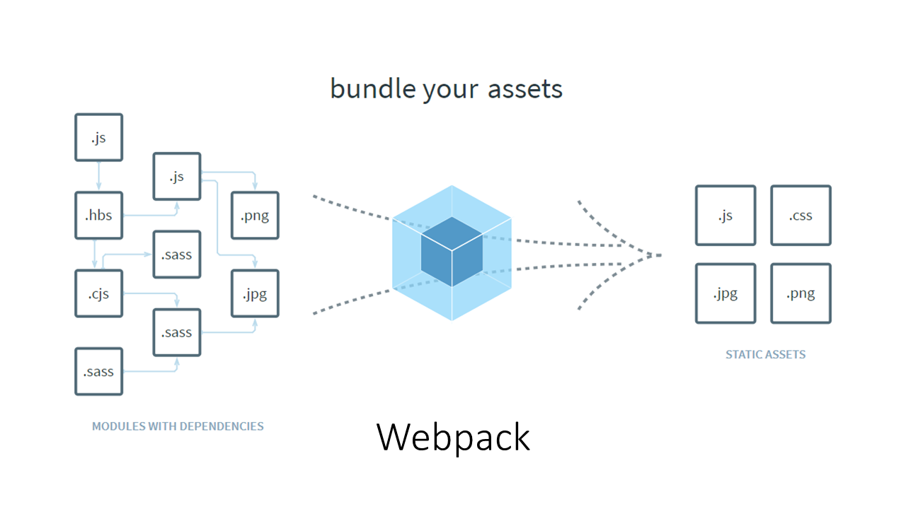

那这里我们先来快速理解一下 Webpack 打包的核心工作过程。我们以一个普通的前端项目为例，项目中一般都会散落着各种各样的代码及资源文件，如下图所示：

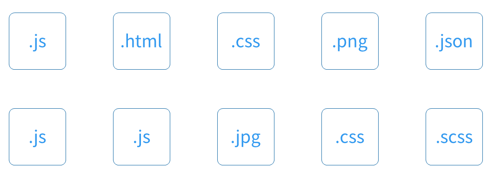

比如 JS、CSS、图片、字体等，这些文件在 Webpack 的思想中都属于当前项目中的一个 *模块*。Webpack 可以通过打包，将它们最终聚集到一起。Webpack 在整个打包的过程中：

- 通过 Loader 处理特殊类型资源的加载，例如加载样式、图片；
- 通过 Plugin 实现各种自动化的构建任务，例如自动压缩、自动发布。

具体来看打包的过程，Webpack 启动后，会根据我们的配置，找到项目中的某个指定文件（一般这个文件都会是一个 JS 文件）作为入口。然后顺着入口文件中的代码，根据代码中出现的 import（ES Modules）或者是 require（CommonJS）之类的语句，解析推断出来这个文件所依赖的资源模块，然后再分别去解析每个资源模块的依赖，周而复始，最后形成整个项目中所有用到的文件之间的依赖关系树，下面这个动画生动的演示了这个过程：

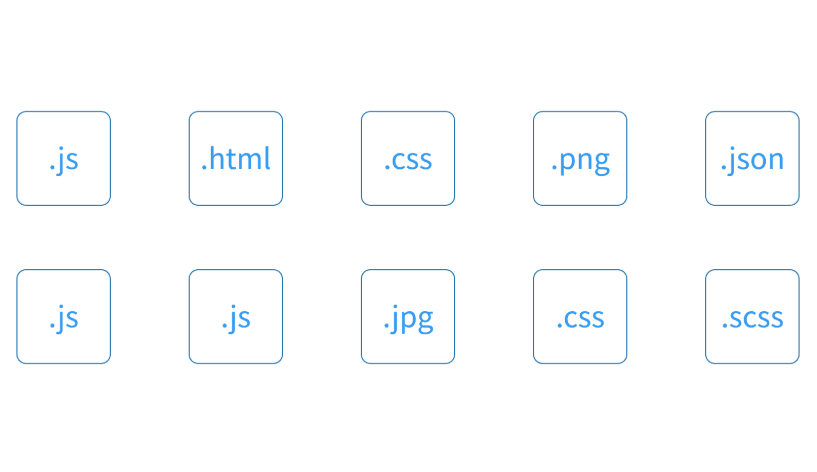

有了这个依赖关系树过后， Webpack 会遍历（递归）这个依赖树，找到每个节点对应的资源文件，然后根据配置选项中的 Loader 配置，交给对应的 Loader 去加载这个模块，最后将加载的结果放入 bundle.js（打包结果）中，从而实现整个项目的打包，具体操作可以参考下面的动画：

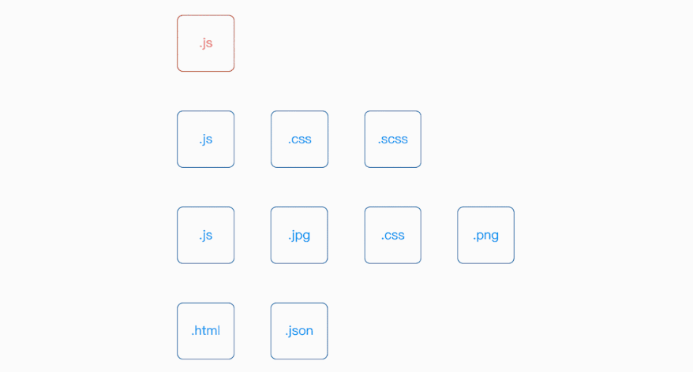

对于依赖模块中无法通过 JavaScript 代码表示的资源模块，例如图片或字体文件，一般的 Loader 会将它们单独作为资源文件拷贝到输出目录中，然后将这个资源文件所对应的访问路径作为这个模块的导出成员暴露给外部。

整个打包过程中，Loader 机制起了很重要的作用，因为如果没有 Loader 的话，Webpack 就无法实现各种各样类型的资源文件加载，那 Webpack 也就只能算是一个用来合并 JS 模块代码的工具了。

至于自定义插件机制，它并不会影响 Webpack 的核心工作过程，只是 Webpack 为了提供一个强大的扩展能力，它为整个工作过程的每个环节都预制了一个钩子，也就是说我们可以通过插件往 Webpack 工作过程的任意环节植入一些自定义的任务，从而扩展 Webpack 打包功能以外的能力。

至此，你就已经了解到了 Webpack 的核心工作过程。

## 工作原理剖析

对于一般的应用开发过程来说，了解以上这些内容基本上就足以应对了，但如果你想了解 Webpack 整个工作过程的细节，那么你就需要更深入地了解刚刚说到的每一个环节，它们落实到代码层面到底做了些什么，或者说是如何实现的。

在这种情况下，我们就必须有针对性的去“查阅”Webpack 的源代码了。注意这里我们强调的是“查阅”，而不是“阅读”。

既然是“查阅”，我们就必须要有个线索，否则挨个去看每个源代码，就是无意义的阅读。这里我们的思路就是顺着前面刚刚介绍的 Webpack 打包的核心工作过程，提炼出关键环节，然后再有针对性地去找每个环节的实现方式就可以了。

这里我们先提炼出 Webpack 核心工作过程中的关键环节，明确“查阅”源码的思路：

1. Webpack CLI 启动打包流程；
2. 载入 Webpack 核心模块，创建 Compiler 对象；
3. 使用 Compiler 对象开始编译整个项目；
4. 从入口文件开始，解析模块依赖，形成依赖关系树；
5. 递归依赖树，将每个模块交给对应的 Loader 处理；
6. 合并 Loader 处理完的结果，将打包结果输出到 dist 目录。

### 一、Webpack CLI

从 Webpack 4 开始 Webpack 的 CLI 部分就被单独抽到了 webpack-cli 模块中，目的是为了增强 Webpack 本身的灵活性。所以这一部分的内容我们需要找到 webpack-cli 所对应的源码。

这里分析的是 v3.3.11 版本的 webpack-cli，你可以参考该版本的源码固定链接。

> P.S. 目前 webpack-cli 官方仓库默认分支下的代码不是 3.x 版本的。

Webpack CLI 的作用就是将 CLI 参数和 Webpack 配置文件中的配置整合，得到一个完整的配置对象。

这部分操作在 webpack-cli 的入口文件 bin/cli.js 中，这个文件中内容比较多，我们这里只截取部分核心代码，你可以对照截图中的行号找到源代码中对应的位置。

首先，Webpack CLI 会通过 yargs 模块解析 CLI 参数（命令行参数），所谓 CLI 参数指的就是我们在运行 webpack 命令时通过命令行传入的参数，例如 --mode=production，具体位置如下：

*node_modules\webpack-cli\bin\cli.js*

 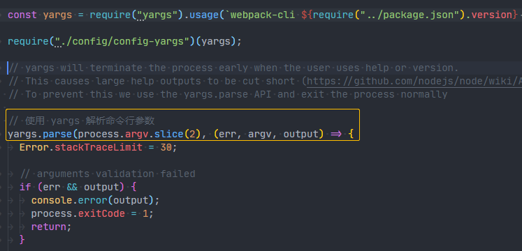

紧接着后面，调用了 `bin/utils/convert-argv.js` 模块，将得到的命令行参数转换为 Webpack 的配置选项对象，具体操作如下：

*node_modules\webpack-cli\bin\cli.js*

 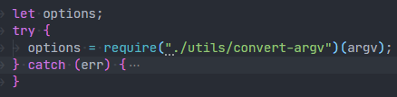

在 convert-argv.js 工作过程中，首先为传递过来的命令行参数设置了默认值，然后判断了命令行参数中是否指定了一个具体的配置文件路径，如果指定了就加载指定配置文件，反之则需要根据默认配置文件加载规则找到配置文件，具体代码如下：

*node_modules\webpack-cli\bin\utils\convert-argv.js*

 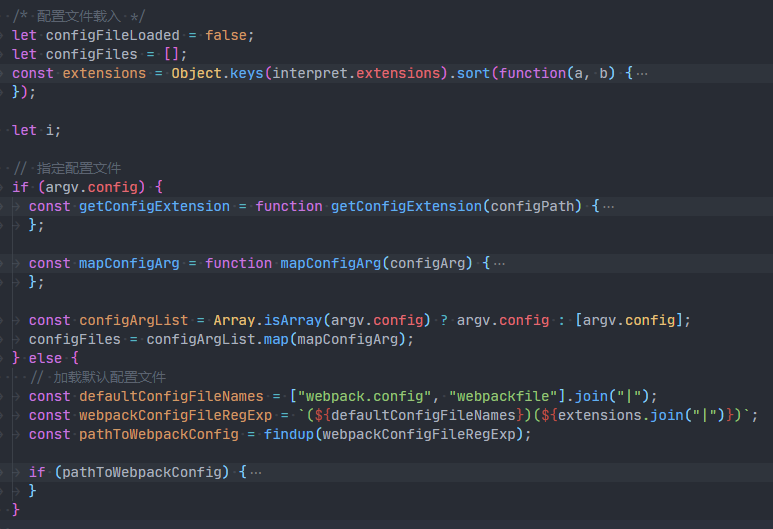

找到配置文件过后，将配置文件中的配置和 CLI 参数中的配置合并，如果出现重复的情况，会优先使用 CLI 参数，最终得到一个完整的配置选项。

有了配置选项过后，开始载入 Webpack 核心模块，传入配置选项，创建 Compiler 对象，这个 Compiler 对象就是整个 Webpack 工作过程中最核心的对象了，负责完成整个项目的构建工作。

*node_modules\webpack-cli\bin\cli.js*

 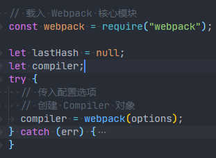

### 二、创建 Compiler 对象

随着 Webpack CLI 载入 Webpack 核心模块，整个执行过程就到了 Webpack 模块中，所以这一部分的代码需要回到 Webpack 模块中，我这里分析的是 v4.43.0 版本的 Webpack，可参考这个版本的 [**源代码的固定链接**](https://github.com/webpack/webpack/tree/v4.43.0)。

同样，先找到这个模块的入口文件，也就是 `lib/webpack.js` 文件。这个文件导出的是一个用于创建 Compiler 的函数，具体如下：

*node_modules\webpack\lib\webpack.js*

 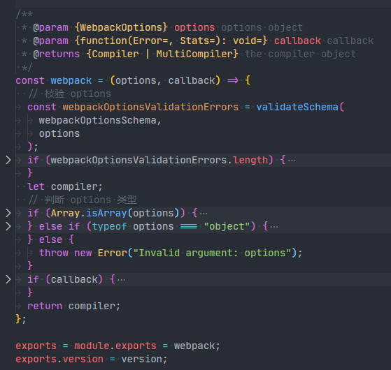

在这个函数中，首先校验了外部传递过来的 options 参数是否符合要求，紧接着判断了 options 的类型。

根据这个函数中的代码，**可以发现 options 不仅仅可以是一个对象，还可以是一个数组**。如果我们传入的是一个数组，那么 Webpack 内部创建的就是一个 MultiCompiler，也就是说 **Webpack 应该支持同时开启多路打包**，配置数组中的每一个成员就是一个独立的配置选项。而如果我们传入的是普通的对象，就会按照我们最熟悉的方式创建一个 Compiler 对象，进行单线打包。

*node_modules\webpack\lib\webpack.js*

 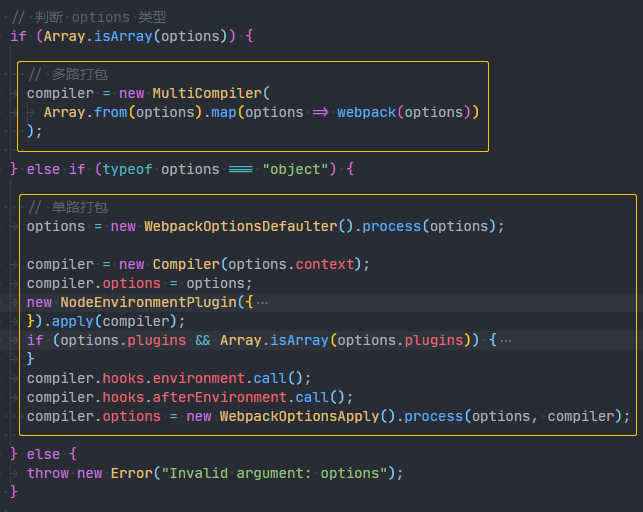

顺着主线接着往下看，在创建了 Compiler 对象过后，Webpack 就开始注册我们配置中的每一个插件了，因为再往后 Webpack 工作过程的生命周期就要开始了，所以必须先注册，这样才能确保插件中的每一个钩子都能被命中。如下图所示：

*node_modules\webpack\lib\webpack.js*

 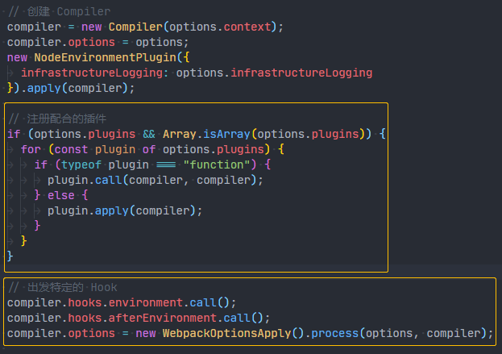

### 三、开始构建

完成 Compiler 对象的创建过后，紧接着这里的代码开始判断配置选项中是否启用了监视模式，具体操作如下：

*node_modules\webpack-cli\bin\cli.js*

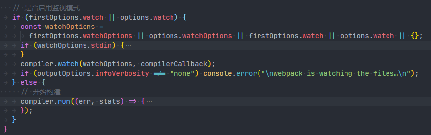

- 如果是监视模式就调用 Compiler 对象的 watch 方法，以监视模式启动构建，但这不是我们主要关心的主线。
- 如果不是监视模式就调用 Compiler 对象的 run 方法，开始构建整个应用。

这个 run 方法定义在 Compiler 类型中，具体文件在 webpack 模块下的 `lib/Compiler.js` 中，代码位置如下：

*node_modules\webpack\lib\Compiler.js*

 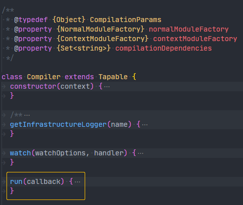

这个方法内部就是先触发了 `beforeRun` 和 `run` 两个钩子，然后最关键的是调用了当前对象的 `compile` 方法，真正开始编译整个项目，具体代码位置如下：

*node_modules\webpack\lib\Compiler.js*

 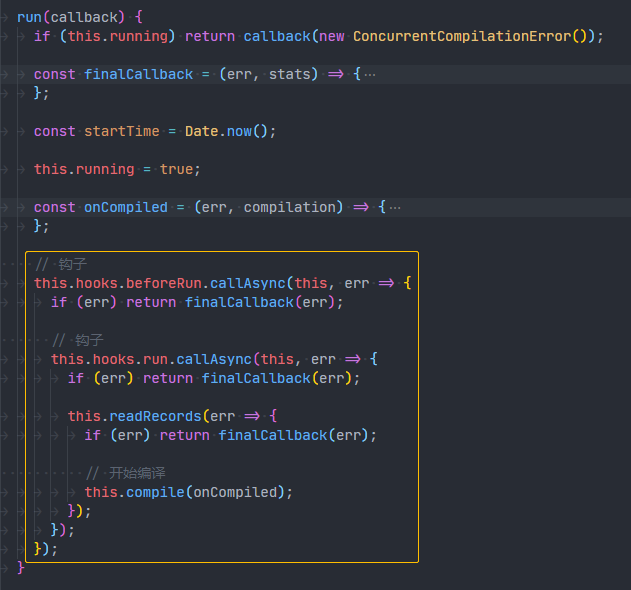

`compile` 方法内部主要就是创建了一个 Compilation 对象，这个对象在之前的章节中有提到，Compilation 字面意思是“合集”，实际上，你就可以理解为一次构建过程中的上下文对象，里面包含了这次构建中全部的资源和信息。

*node_modules\webpack\lib\Compiler.js*

 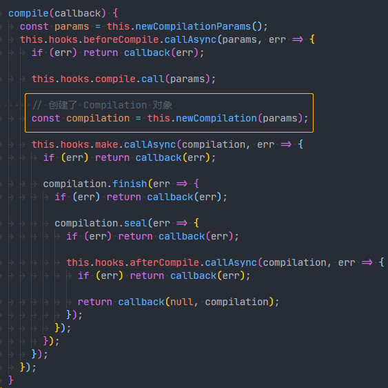

创建完 Compilation 对象过后，紧接着触发了一个叫作 make 的钩子，进入整个构建过程最核心的 make 阶段。

### 四、make 阶段

make 阶段主体的目标就是：根据 entry 配置找到入口模块，开始依次递归出所有依赖，形成依赖关系树，然后将递归到的每个模块交给不同的 Loader 处理。

 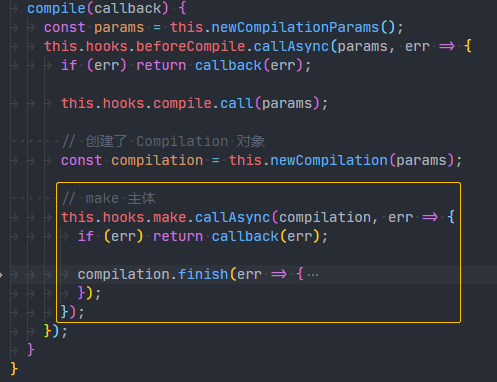

由于这个阶段的调用过程并不像之前一样，直接调用某个对象的某个方法，而是采用事件触发机制，让外部监听这个 make 事件的地方开始执行。

> 简单提示一下：想要知道这个事件触发后，哪些地方会开始执行，前提是得知道哪里注册了这个叫作 make 的事件。

Webpack 的插件系统是基于官方自己的 Tapable 库实现的，我们想要知道在哪里注册了某个事件，必须要知道如何注册的事件。Tapable 的注册方式具体如下：

> The following lifecycle hooks are exposed by the `compiler` and can be accessed as such:

```js
// someHook：事件名称
// (params) => {}：事件处理函数
compiler.hooks.someHook.tap('MyPlugin', (params) => {});
```

所以，我们只需要通过开发工具搜索源代码中的 `make.tap`，就应该能够找到事件注册的位置，具体操作如下：

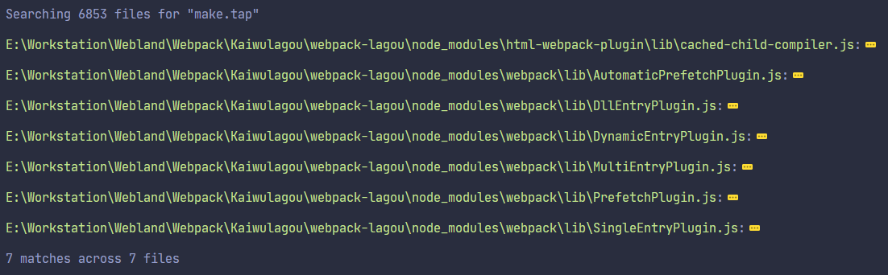

这里搜索到七个插件，除了 html-webpack-plugin 是安装的，其他六个插件实际上是创建的，刚刚因为没有影响，所以就忽略了：

*node_modules\webpack\lib\webpack.js*

 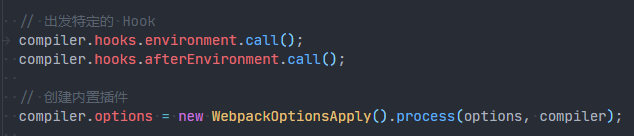

我们默认使用的就是单一入口打包的方式，所以这里最终会执行其中的 SingleEntryPlugin。

*node_modules\webpack\lib\WebpackOptionsApply.js*

 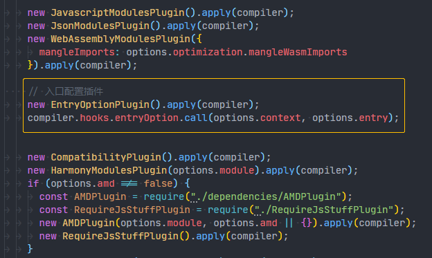

*node_modules\webpack\lib\EntryOptionPlugin.js*

 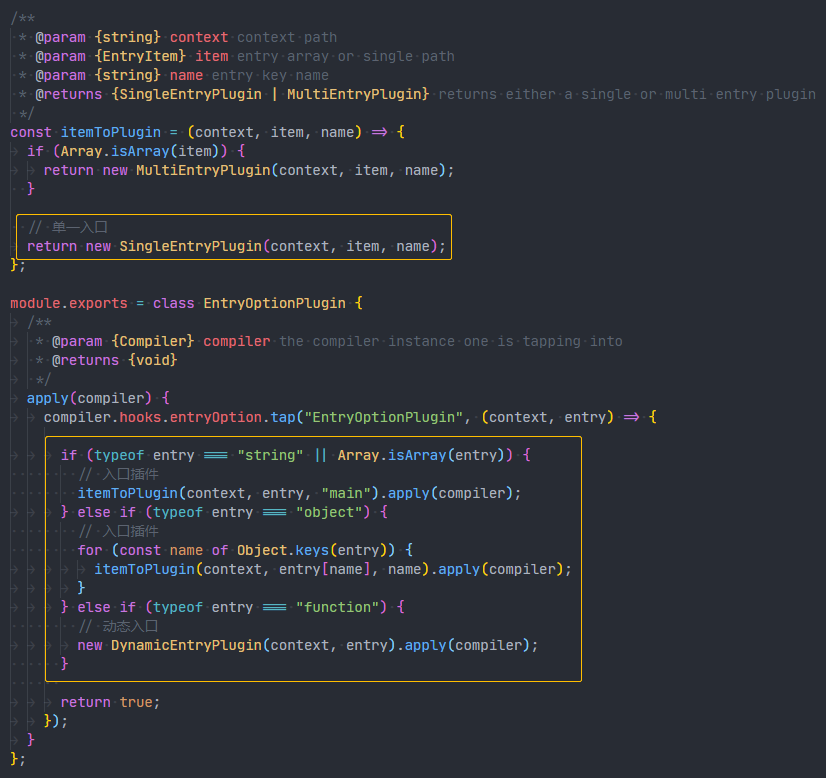

SingleEntryPlugin 中调用了 Compilation 对象的 addEntry 方法，开始解析入口；

*node_modules\webpack\lib\SingleEntryPlugin.js*

 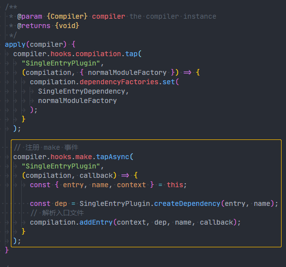

addEntry 方法中又调用了 _addModuleChain 方法，将入口模块添加到模块依赖列表中；

*node_modules\webpack\lib\Compilation.js*

 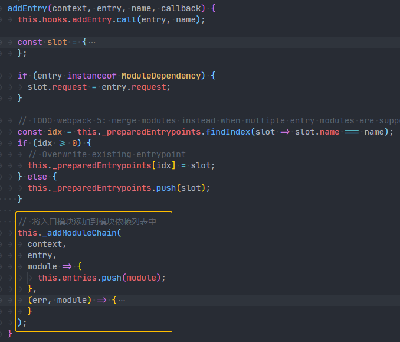

紧接着通过 Compilation 对象的 buildModule 方法进行模块构建；

*node_modules\webpack\lib\Compilation.js*

 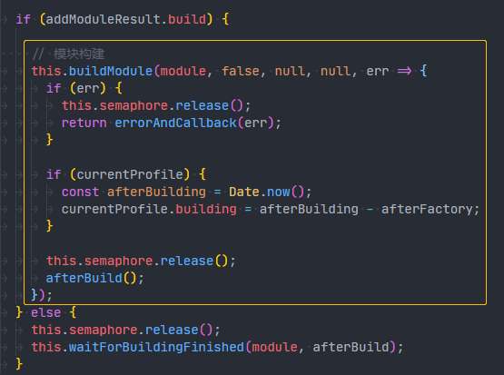

buildModule 方法中执行具体的 Loader，处理特殊资源加载；

*node_modules\webpack\lib\Compilation.js*

 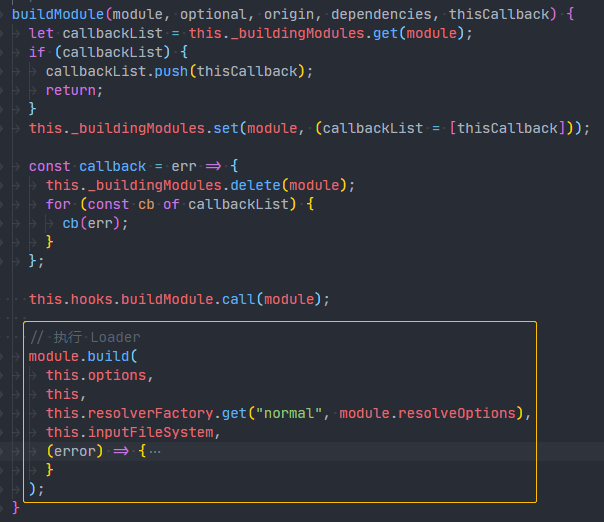

build 完成过后，通过 acorn 库生成模块代码的 AST 语法树；

https://kaiwu.lagou.com/course/courseInfo.htm?courseId=88#/detail/pc?id=2265

https://cloud.tencent.com/developer/article/1606550

https://juejin.im/post/5c1859745188254fef232ead#heading-19

https://blog.csdn.net/hjb2722404/article/details/89384477

https://blog.csdn.net/hjb2722404/article/details/101512452

https://github.com/hjb2722404/javascript-Pattern

https://www.jianshu.com/u/b868db9f7847


https://www.oschina.net/translate/understanding-process-next-tick?print

https://blog.csdn.net/lihongxun945/article/details/79866134


https://segmentfault.com/a/1190000015917768?utm_source=tag-newest

https://www.cnblogs.com/QH-Jimmy/p/8041875.html


http://www.mamicode.com/info-detail-2139640.html


https://www.cnblogs.com/QH-Jimmy/p/8250774.html


https://blog.csdn.net/long5305350/article/details/96973020#SingleEntryDependency


https://www.jianshu.com/p/7851001dd93b