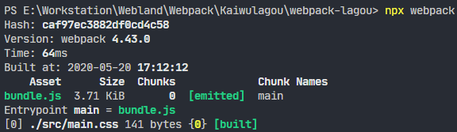

# 如何通过 Loader 实现特殊资源加载？

Webpack 想要实现的是整个前端项目的模块化，项目中的各种资源（包括 CSS 文件、图片等）都应该属于需要被管理的模块。换句话说， Webpack 不仅是 JavaScript 模块打包工具，还是整个前端项目（前端工程）的模块打包工具。也就是说，我们可以通过 Webpack 去管理前端项目中任意类型的资源文件。

## 如何加载资源模块

首先，我们尝试通过 Webpack 打包项目中的一个 CSS 文件，由此开始探索 Webpack 是如何加载资源模块的？

在下面这个案例中，我们在项目的 src 目录下添加一个普通的样式文件 main.css，具体结构和样式代码如下所示：

```
> webpack-loader
  ├ src
+ │  └ main.css
  ├ package.json
  └ webpack.config.js

```

*src\main.css*

```css
body {
  margin: 0 auto;
  padding: 0 20px;
  max-width: 800px;
  background: #f4f8fb;
}

```

然后将 Webpack 配置中的入口文件路径指定为 main.css 的文件路径，让 Webpack 直接打包 CSS 资源文件，具体配置如下所示：

*webpack.config.js*

```js
module.exports = {
  mode: 'none',
  entry: './src/main.css',
  output: {
    filename: 'bundle.js'
  },
}

```

> Webpack 并没有强制要求我们必须以 JS 文件作为打包入口，只是在绝大多数情况下，我们会用 JS 文件作为打包入口，因为 JS 文件才是程序的逻辑入口，以 JS 文件作为入口相对更合理。

 配置完成过后回到命令行终端再次运行 Webpack 打包命令，此时你会发现命令行报出了一个模块解析错误，如下所示：


错误信息大体的意思是说，在解析模块过程中遇到了非法字符，而且错误出现的位置就是在我们的 CSS 文件中。

出现这个错误的原因是因为 **Webpack 内部默认只能够处理 JS 模块代码**，也就是说在打包过程中，它默认把所有遇到的文件都当作 JavaScript 代码进行解析，但是此处我们让 Webpack 处理的是 CSS 代码，而 CSS 代码是不符合 JavaScript 语法的，所以自然会报出模块解析错误。

为了佐证 Webpack 默认只能够按照 JavaScript 语法解析模块，你可以尝试将 main.css 文件中的代码修改为一段 JavaScript 代码，然后重新运行 Webpack 打包来看一下结果。具体操作如下

*console.log('This is a style sheet.') *

```css
/* 只是为了证明 Webpack 默认按照 JS 语法解析模块 */
console.log('This is a style sheet.') 
/* body {...} */

```

 

> **注意：这里在 CSS 中编写 JS 代码只是为了证实我们的观点，并不是真的要这样使用！**

回到前面提到的错误描述中，有一个非常重要的提示：

```
You may need an appropriate loader to handle this file type, currently no loaders are configured to process this file. 
（我们需要用适当的加载器来处理这种文件类型，而当前并没有配置一个可以用来处理此文件的加载器）。
```

根据这个错误说明，我们发现 Webpack 是用 Loader（加载器）来处理每个模块的，而内部默认的 Loader 只能处理 JS 模块，如果需要加载其他类型的模块就需要配置不同的 Loader。这也就引出了今天的主角：*Loader*。

 

## 加载器的使用方式

需要的是一个可以加载 CSS 模块的 Loader，最常用到的是 css-loader。我们需要通过 npm 先去安装这个 Loader，然后在配置文件中添加对应的配置，具体操作和配置如下所示：

```sh
$ npm install css-loader --save-dev 
```

*webpack.config.js*

```js
module.exports = {
  mode: 'none',
  entry: './src/main.css',
  output: {
    filename: 'bundle.js'
  },
  module: {
    rules: [
      {
        // 根据打包过程中所遇到文件路径匹配是否使用这个 loader
        test: /\.css$/,
        // 指定具体的 loader
        use: 'css-loader'
      }
    ]
  }
}

```

在配置对象的 module 属性中添加一个 rules 数组。这个数组就是我们针对资源模块的加载规则配置，其中的每个规则对象都需要设置两个属性：

- 首先是 test 属性，它是一个正则表达式，用来匹配打包过程中所遇到文件路径，这里我们是以 .css 结尾；
- 然后是 use 属性，它用来指定匹配到的文件需要使用的 loader，这里用到的是 css-loader。

配置完成过后，我们回到命令行终端重新运行打包命令，打包过程就不会再出现错误了，因为这时 CSS 文件会交给 css-loader 处理过后再由 Webpack 打包。


## 样式模块加载的问题

### css-loader

此时，如果你尝试在页面中使用这里输出的 bundle.js 文件，你会发现刚刚的这个 main.css 模块并没有工作。

> 如果你之前有些经验，可能知道这个问题的解法，其实很简单，只需要再额外添加一个 style-loader，样式就可以正常工作了。

不过只有解法没有原因不是我们的风格。下面我们来分析产生这个问题的真正原因，

- 首先，我们找到刚刚生成的 bundle.js 文件，因为这个文件是 Webpack 打包后的结果，所有的模块都应该在这个文件中出现。

由于默认打包入口在 Webpack 输出的结果中就是第一个模块，所以我们只需要看第一个模块目前是什么样的，如下所示：

```js
/* 0 */
/***/
(function(module, exports, __webpack_require__) {

  // Imports
  var ___CSS_LOADER_API_IMPORT___ = __webpack_require__(1);
  exports = ___CSS_LOADER_API_IMPORT___(false);
  // Module
  exports.push([module.i, "body {\r\n  margin: 0 auto;\r\n  padding: 0 20px;\r\n  max-width: 800px;\r\n  background: royalblue;\r\n}\r\n", ""]);
  // Exports
  module.exports = exports;

  /***/
}),
```

仔细阅读这个文件，你会发现 css-loader 的作用是将 CSS 模块转换为一个 JS 模块，具体的实现方法是将我们的 CSS 代码 push 到一个数组中，这个数组是由 css-loader 内部的一个模块提供的，但是整个过程并没有任何地方使用到了这个数组。

因此这里样式没有生效的原因是： **css-loader 只会把 CSS 模块加载到 JS 代码中，而并不会使用这个模块**。

### style-loader

所以这里我们还需要在 css-loader 的基础上再使用一个 style-loader，把 css-loader 转换后的结果通过 style 标签追加到页面上。

```sh
$ npm install style-loader --save-dev
```

安装完 style-loader 之后，我们将配置文件中的 use 属性修改为一个数组，将 style-loader 也放进去。这里需要注意的是，**一旦配置多个 Loader，执行顺序是从后往前执行的**，所以这里一定要将 css-loader 放在最后，因为必须要 css-loader 先把 CSS 代码转换为 JS 模块，才可以正常打包，具体配置如下：

*webpack.config.js*

```js
module.exports = {
  mode: 'none',
  entry: './src/main.css',
  output: {
    filename: 'bundle.js'
  },
  module: {
    rules: [
      {
        test: /\.css$/,
        // 对同一个模块使用多个 loader，注意顺序
        use: [
          'style-loader',
          'css-loader'
        ]
      }
    ]
  }
}

```

配置完成之后，再次回到命令行重新打包，此时 bundle.js 文件中会额外多出两个模块。

*dist\bundle.js*

```js
/* 0 */
/***/
(function(module, exports, __webpack_require__) {

  // API: add CSS
  var api = __webpack_require__(1);
  // CSS content
  var content = __webpack_require__(2);

  content = content.__esModule ? content.default: content;

  if (typeof content === 'string') {
    content = [[module.i, content, '']];
  }

  var options = {};

  options.insert = "head";
  options.singleton = false;

  // add CSS style tag
  var update = api(content, options);

  module.exports = content.locals || {};

  /***/
}),
```

**style-loader 的作用总结一句话就是，将 css-loader 中所加载到的所有样式模块，通过创建 style 标签的方式添加到页面上**。

> Loader 是 Webpack 实现整个前端模块化的核心。因为只有通过不同的 Loader，Webpack 才可以实现任何类型资源的加载。

## 通过 JS 加载资源模块

**正如刚刚所提到的，一般 Webpack 打包的入口还是 JavaScript**。因为从某种程度上来说，打包入口就是应用的运行入口，而目前前端应用中的业务是由 JS 驱动的，所以更合理的做法还是把 JS 文件作为打包的入口，然后在 JS 代码中通过 import 语句去加载 CSS 文件。

```
> webpack-loader
  ├ src
  │  ├ style.css
+ │  └ main.js
  ├ package.json
  └ webpack.config.js
```

*src\main.js*

```js
import './main.js'

// api logic
console.log('App starts running~');
```


```sh
$ npx webpack
```

*dist\bundle.js*

```js
/* 0 */
/***/
(function(module, __webpack_exports__, __webpack_require__) {

  "use strict";
  __webpack_require__.r(__webpack_exports__);
  /* harmony import */
  var _main_css__WEBPACK_IMPORTED_MODULE_0__ = __webpack_require__(1);
  /* harmony import */
  var _main_css__WEBPACK_IMPORTED_MODULE_0___default =
  /*#__PURE__*/
  __webpack_require__.n(_main_css__WEBPACK_IMPORTED_MODULE_0__);

  // api logic
  console.log('App starts running~');

  /***/
}),
/* 1 */
/***/
(function(module, exports, __webpack_require__) {

  var api = __webpack_require__(2);
  var content = __webpack_require__(3);

  content = content.__esModule ? content.default: content;

  if (typeof content === 'string') {
    content = [[module.i, content, '']];
  }

  var options = {};

  options.insert = "head";
  options.singleton = false;

  var update = api(content, options);

  module.exports = content.locals || {};

  /***/
}),
```

即便是通过 JS 代码去加载的 CSS 模块，css-loader 和 style-loader 仍然可以正常工作。因为 Webpack 在打包过程中会循环遍历每个模块，然后根据配置将每个遇到的模块交给对应的 Loader 去处理，最后再将处理完的结果打包到一起。

## 为什么要在 JS 中加载其他资源

> 说到这里，你可能会产生疑惑：Webpack 为什么要在 JS 中载入 CSS 呢？不是应该将样式和行为分离么？

**其实 Webpack 不仅是建议我们在 JavaScript 中引入 CSS，还会建议我们在代码中引入当前业务所需要的任意资源文件**。因为真正需要这个资源的并不是整个应用，而是你此时正在编写的代码。这就是 Webpack 的设计哲学。

> 乍一想好像不太容易理解，那你可以做一个假设：假设我们在开发页面上的某个局部功能时，需要用到一个样式模块和一个图片文件。如果你还是将这些资源文件单独引入到 HTML 中，然后再到 JS 中添加对应的逻辑代码。试想一下，如果后期这个局部功能不用了，你就需要同时删除 JS 中的代码和 HTML 中的资源文件引入，也就是同时需要维护这两条线。而如果你遵照 Webpack 的这种设计，所有资源的加载都是由 JS 代码控制，后期也就只需要维护 JS 代码这一条线了。

所以说，通过 JavaScript 代码去引入资源文件，或者说是建立 JavaScript 和资源文件的依赖关系，具有明显的优势。

因为 JavaScript 代码本身负责完成整个应用的业务功能，放大来说就是驱动了整个前端应用，而 JavaScript 代码在实现业务功能的过程中需要用到样式、图片等资源文件。如果建立这种依赖关系：

- 一来逻辑上比较合理，因为 JS 确实需要这些资源文件配合才能实现整体功能；
- 二来配合 Webpack 这类工具的打包，能确保在上线时，资源不会缺失，而且都是必要的。

> 学习新事物不是说学会它的所有用法你就能提高，因为这些照着文档操作基本上谁都可以做到，很多时候它的思想才是突破点。能搞明白新事物为什么这样设计，基本上你就算出道了。

至于其他常用的加载器，我们在理解了 Loader 的机制过后，你可以通过官方的文档自行尝试。这里罗列了几个开发经常用到的加载器，如下表所示：

- file-loader	https://webpack.js.org/loaders/file-loader
- url-loader	https://webpack.js.org/loaders/url-loader
- babel-loader	https://webpack.js.org/loaders/babel-loader
- style-loader	https://webpack.js.org/loaders/style-loader
- css-loader	https://webpack.js.org/loaders/css-loader
- sass-loader	https://webpack.js.org/loaders/sass-loader
- postcss-loader	https://webpack.js.org/loaders/postcss-loader
- eslint-loader	https://github.com/webpack-contrib/eslint-loader
- vue-loader	https://github.com/vuejs/vue-loader

我每接触到一个新的加载器，核心就是搞明白这个 Loader 内部到底做了什么事情，它的目标是什么，其次才是这个 Loader 的配置用法。

## 开发一个 Loader

Loader 作为 Webpack 的核心机制，内部的工作原理却非常简单。接下来我们一起来开发一个自己的 Loader，通过这个开发过程再来深入了解 Loader 的工作原理。

### 新建 Loader

这里我的需求是开发一个可以加载 markdown 文件的加载器，以便可以在代码中直接导入 md 文件。我们都应该知道 markdown 一般是需要转换为 html 之后再呈现到页面上的，所以我希望导入 md 文件后，直接得到 markdown 转换后的 html 字符串，如下图所示：


为了直观地演示，这里不再单独创建一个 npm 模块，就直接在项目根目录下创建一个 markdown-loader.js 文件，完成后可以再把这个模块发布到 npm 上作为一个独立的模块使用。

项目结构与核心代码如下所示：

```
> webpack-loader
  ├ src
  │  ├ about.md
  │  └ main.js
  ├ package.json
+ ├ markdown-loader.js
  └ webpack.config.js
```

*src\about.md*

```markdown
# About

This is a markdown file.
```

*src\main.js*

```js
import about from './about.md'

console.log(about)
// about => '<h1>About</h1><p>this is a markdown file.</p>'
```

每个 Webpack 的 Loader 都需要导出一个函数，这个函数就是我们这个 Loader 对资源的处理过程，它的输入就是加载到的资源文件内容，输出就是我们加工后的结果。

我们通过 source 参数接收输入，通过返回值输出。这里我们先尝试打印一下 source，然后在函数的内部直接返回一个字符串 hello loader ~，具体代码如下所示：

*markdown-loader.js*

```js
module.exports = source => {
  console.log('# Markdown Loader #')
  console.log(source)
  return 'hello loader ~'
}
```

完成以后，回到 Webpack 配置文件中添加一个加载器规则，这里匹配到的扩展名是 .md，使用的加载器就是我们刚刚编写的这个 markdown-loader.js 模块，具体代码如下所示：

*webpack.config.js*

```js
module.exports = {
  mode: 'none',
  entry: './src/main.js',
  output: {
    filename: 'bundle.js'
  },
  module: {
    rules: [
      {
        test: /\.md$/,
        use: './markdown-loader'
      }
    ]
  }
}

```

> 这里的 use 中不仅可以使用模块名称，还可以使用模块文件路径，这点与 Node 中的 require 函数是一样的。

配置完成后，我们再次打开命令行终端运行打包命令，如下图所示：

 

打包过程中命令行确实打印出来了我们所导入的 Markdown 文件内容，这就意味着 Loader 函数的参数确实是文件的内容。

但同时也报出了一个解析错误，说的是：

```
You may need an additional loader to handle the result of these loaders.
（我们可能还需要一个额外的加载器来处理当前加载器的结果）
```

*dist\bundle.js*

```js
/* 1 */
/***/
(function(module, exports) {

  throw new Error("Module parse failed: Unexpected token (1:6)\nFile was processed with these loaders:\n * ./markdown-loader.js\nYou may need an additional loader to handle the result of these loaders.\n> hello loader ~");

  /***/
})
```

那这究竟是为什么呢？其实 Webpack 加载资源文件的过程类似于一个工作管道，你可以在这个过程中依次使用多个 Loader，但是**最终这个管道结束过后的结果必须是一段标准的 JS 代码字符串**。


所以我们这里才会出现上面提到的错误提示，那解决的办法也就很明显了：

- 直接在这个 Loader 的最后返回一段 JS 代码字符串；
- 再找一个合适的加载器，在后面接着处理我们这里得到的结果。

先来尝试第一种办法。回到 markdown-loader 中，我们将返回的字符串内容修改为`console.log('hello loader~')`，然后再次运行打包，此时 Webpack 就不再会报错了，代码如下所示：

*markdown-loader.js*

```js
module.exports = source => {
  console.log('# Markdown Loader #')
  console.log(source)
  return `console.log('hello loader ~')`;
}
```

那此时打包的结果是怎样的呢？我们打开输出的 bundle.js，找到最后一个模块（因为这个 md 文件是后引入的），如下所示：

*dist\bundle.js*

```js
/* 1 */
/***/
(function(module, exports) {

  console.log('hello loader ~')

  /***/
})
```

这个模块里面非常简单，就是把我们刚刚返回的字符串直接拼接到了该模块中。这也解释了刚刚 Loader 管道最后必须返回 JS 代码的原因，因为如果随便返回一个内容，放到这里语法就不通过了。

### 实现 Loader 的逻辑

了解了 Loader 大致的工作机制过后，我们再回到 markdown-loader.js 中，接着完成我的需求。这里需要安装一个能够将 Markdown 解析为 HTML 的模块，叫作 marked。

```sh
$ npm i marked --save-dev
```

安装完成后，我们在 markdown-loader.js 中导入这个模块，然后使用这个模块去解析我们的 source。这里解析完的结果就是一段 HTML 字符串，如果我们直接返回的话同样会面临 Webpack 无法解析模块的问题，正确的做法是把这段 HTML 字符串拼接为一段 JS 代码。

此时我们希望返回的代码是通过 module.exports 导出这段 HTML 字符串，这样外界导入模块时就可以接收到这个 HTML 字符串了。如果只是简单地拼接，那 HTML 中的换行和引号就都可能会造成语法错误，所以我这里使用了一个小技巧，具体操作如下所示：

*markdown-loader.js*

```js
const marked = require('marked')

module.exports = source => {
  const html = marked(source)
  const code = `module.exports = ${JSON.stringify(html)}`
  return code
}

```

> 先通过 JSON.stringify() 将字段字符串转换为标准的 JSON 字符串，然后再参与拼接，这样就不会有问题了。

回到命令行再次运行打包，打包后的结果就是我们所需要的了。

*dist\bundle.js*

```js
([
/* 0 */
/***/
(function(module, __webpack_exports__, __webpack_require__) {

  "use strict";
  __webpack_require__.r(__webpack_exports__);
  /* harmony import */
  var _about_md__WEBPACK_IMPORTED_MODULE_0__ = __webpack_require__(1);

  console.log(_about_md__WEBPACK_IMPORTED_MODULE_0__["default"])
  // about => '<h1>About</h1><p>this is a markdown file.</p>'
  /***/
}),
/* 1 */
/***/
(function(module, __webpack_exports__, __webpack_require__) {

  "use strict";
  __webpack_require__.r(__webpack_exports__);
  /* harmony default export */
  __webpack_exports__["default"] = ("<h1 id=\"about\">About</h1>\n<p>This is a markdown file.</p>\n");

  /***/
})
/******/
]);
```

> 除了 module.exports 这种方式，Webpack 还允许我们在返回的代码中使用 ES Modules 的方式导出，例如，我们**这里将 module.exports 修改为 export default**，然后运行打包，结果同样是可以的，Webpack 内部会自动转换 ES Modules 代码。

*markdown-loader.js*

```js
const marked = require('marked')

module.exports = source => {
  const html = marked(source)
  // const code = `module.exports = ${JSON.stringify(html)}`
  const code = `export default ${JSON.stringify(html)}`
  return code
}

```

### 多个 Loader 的配合

我们还可以尝试一下刚刚说的第二种思路，就是在我们这个 markdown-loader 中直接返回 HTML 字符串，然后交给下一个 Loader 处理。这就涉及多个 Loader 相互配合工作的情况了。

我们回到代码中，这里我们直接返回 marked 解析后的 HTML，代码如下所示：

*markdown-loader.js*

```js
const marked = require('marked')

module.exports = source => {
  const html = marked(source)
  return html
}

```

然后我们再安装一个处理 HTML 的 Loader，叫作 html-loader，代码如下所示：

```sh
$ npm i html-loader --save-dev
```

安装完成过后回到配置文件，这里同样把 use 属性修改为一个数组，以便依次使用多个 Loader。不过同样需要注意，这里的执行顺序是从后往前，也就是说我们应该把先执行的 markdown-loader 放在后面，html-loader 放在前面。

*webpack.config.js*

```js
module.exports = {
  mode: 'none',
  entry: './src/main.js',
  output: {
    filename: 'bundle.js'
  },
  module: {
    rules: [
      {
        test: /\.md$/,
        use: [
          'html-loader',
          './markdown-loader'
        ]
      }
    ]
  }
}

```

完成以后我们回到命令行终端再次打包，这里的打包结果仍然是可以的。

*dist\bundle.js*

```js
/* 0 */
/***/
(function(module, __webpack_exports__, __webpack_require__) {

  "use strict";
  __webpack_require__.r(__webpack_exports__);
  /* harmony import */
  var _about_md__WEBPACK_IMPORTED_MODULE_0__ = __webpack_require__(1);
  /* harmony import */
  var _about_md__WEBPACK_IMPORTED_MODULE_0___default =
  /*#__PURE__*/
  __webpack_require__.n(_about_md__WEBPACK_IMPORTED_MODULE_0__);

  console.log(_about_md__WEBPACK_IMPORTED_MODULE_0___default.a)
  // about => '<h1>About</h1><p>this is a markdown file.</p>'
  /***/
}),
/* 1 */
/***/
(function(module, exports) {

  // Module
  var code = "<h1 id=\"about\">About</h1>\n<p>This is a markdown file.</p>\n";
  // Exports
  module.exports = code;

  /***/
})

```

至此，我们就完成了这个 markdown-loader 模块，其实整个过程重点在于 Loader 的工作原理和实现方式。

## 总结

总体来说，Loader 机制是 Webpack 最核心的机制，因为正是有了 Loader 机制，Webpack 才能足以支撑整个前端项目模块化的大梁，实现通过 Webpack 去加载任何你想要加载的资源。

换个角度来说，也正是有了 Loader 这种扩展机制，社区才能不断地为 Webpack 添砖加瓦，形成今天 Webpack 在前端工程化中不可撼动的地位。

如果我们想要玩转 Webpack，就必须加深对 Loader 机制和原理的理解。

> 除此之外，还有一点：Webpack 中实现的这种 “万物皆模块” 的理念值得我们深入思考。因为它确实打破了“在页面中引入各种资源”的这种传统的固化思维，让我们可以在业务代码中载入所需的一切资源，在真正意义上让 JavaScript 驱动一切。如果你之前饱受资源维护的痛苦，那这种方式一定值得尝试。

